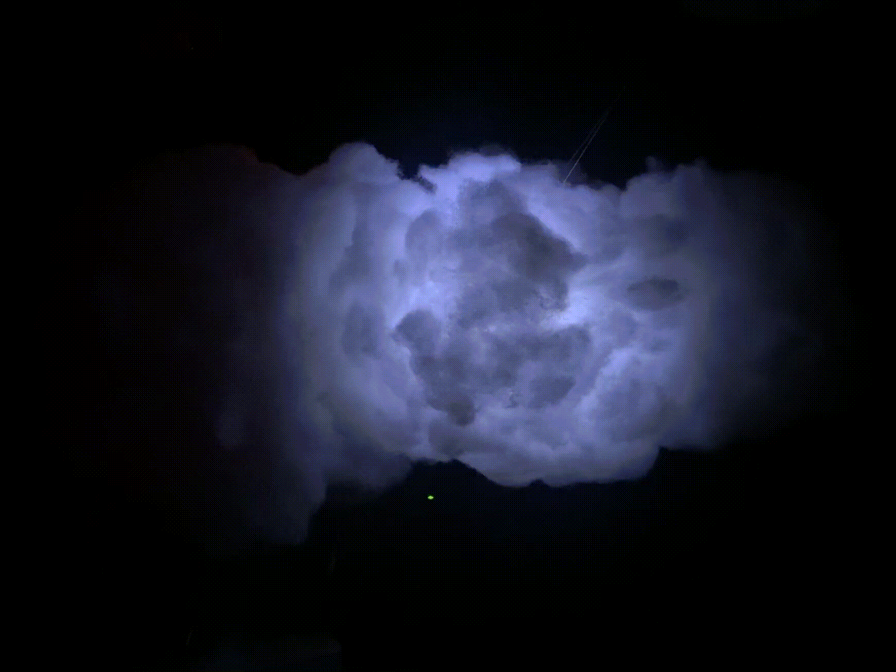
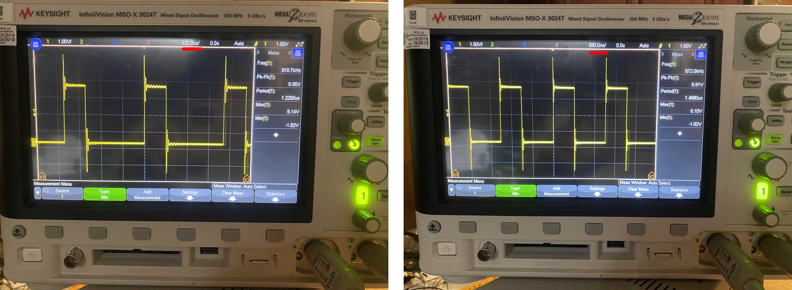
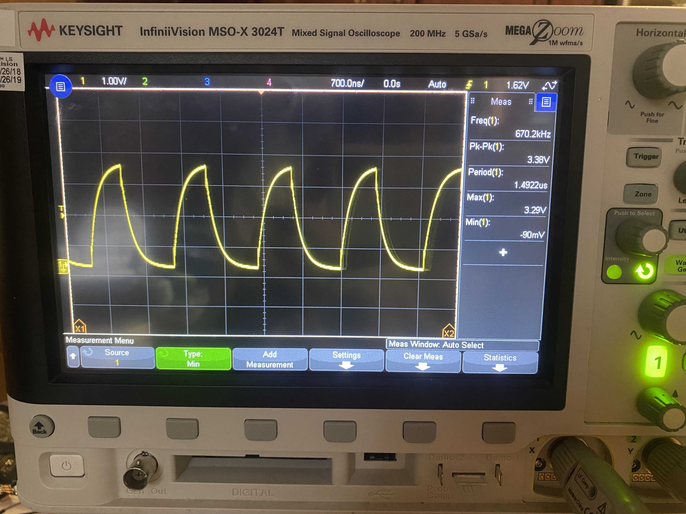
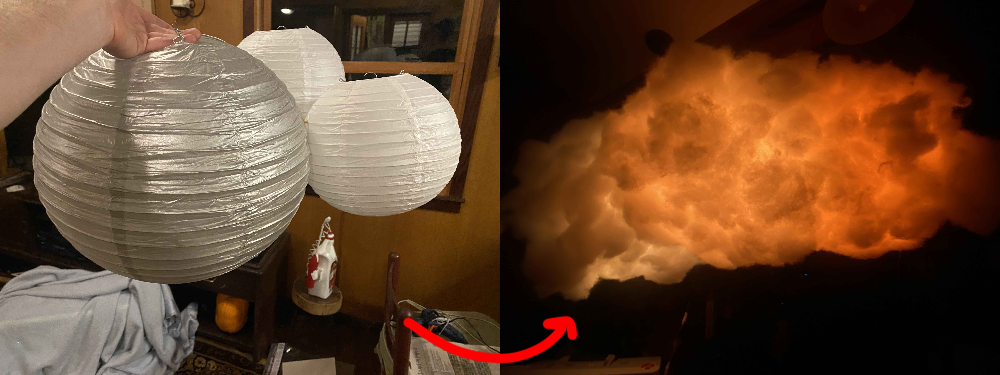

# CS107E NeoPixel Final Project



## Setting up your NeoPixels

- Get a strip of NeoPixels [(here're the ones I bought)](https://www.amazon.com/gp/product/B078S6Z9KG/ref=ppx_yo_dt_b_asin_title_o08_s00?ie=UTF8&psc=1).
- Get a 300-500 ohm resistor, 1000 uF capacitor, and [a power source for your neopixels](https://learn.adafruit.com/adafruit-neopixel-uberguide/powering-neopixels).
- Wire the capacitor in parallel with your power lines and the resistor in series with the output data line from the pi and the input neopixel data line
- Important: wire a pi ground pin in parallel with your power ground pin to share a reference for your signals
- Finish off the last wiring and run the code :-) 

## Project Rundown 
Here I create a basic driver for arduino neopixels to be run by output pin of raspberry pi. I origianlly tried for a long time to use the Pi's Timer Control Register to increase the counting frequency to a point where one could avoid using asembly to send data bits to the neopixels. I increased to clock frequency to 10Mhz (and eventually 250 Mhz) with the following code: 
```
// Code to run counter at 10 per microsecond!!!
volatile unsigned int *pinAddress;
pinAddress = (unsigned int *)0x2000B408; // Free Running Counter
volatile unsigned int *pinAddress_counter;
pinAddress_counter = (unsigned int *)0x2000B420; // Free Running Counter
// before changing clock frequency
printf("Time-Control Register = %d\n", *pinAddress);
unsigned int start = *pinAddress_counter;
//printf("%d\n", *pinAddress_counter);
timer_delay(10);
unsigned int stop = *pinAddress_counter;
unsigned int difference = stop - start;
printf("%d\n", difference);
*pinAddress = 0b000110000000001000000000;
printf("Time-Control Register = %d\n", *pinAddress);
start = *pinAddress_counter;
timer_delay(10);
stop = *pinAddress_counter;
difference = stop - start;
printf("%d\n", difference);
```
However, after much troubleshooting, trying inline code vs. function calls, and changing the system caching system I decided to get a hold of an occiliscope to verify the signals. At a clock frequency of 250Mhz, the delays only could reach a frequency of 1MHz due to limitations in the speed of a non-assembly for loop and gpio_set high function call. Thus, I changed to Julie's awesome assembly neopixel timing code (which was a lifesaver) and did some tests with the occiliscope. 



I then did a sanity check with the reccomended pullup resistor of 300 - 500 ohms (mine was 390 ohms) to get a similar signal: 



For the project, I'm using a slightly newer model neopixel than the asembly code was written for, so I tried both the reccomended new signal times and the old bit times. Both worked, so I decided to keep the old bit timings so the code could work across models. Also, the reset bit changed quite a lot, but this is defined at the top of the neopixel.c code to allow the user to change bw old and new neopixels. 

After spending two days wondering why these signals didn't work, I figured out I hadn't grounded the pi to a common ground to my power source (which I've included in the Setup instructions section). I also learned that my power supply was not able to run all 300 of my neopixels without setting them to a lower brightness. I tried increasing the voltage beyond 5V, but this seemed to only work when not sending signals (as the signals need a ~5V power input to pass instructions correctly. 

Once th signals were sending right, I wrote a basic driver generalized to any size of neopixel strip. The driver runs off of a type of bufffer array that contains all the pixel values for the strip at one time. With this simple driver I tested a few simple but well tested light display functions, culminating in the run_lightening() function for my cloud light. 

I then did a little bit of arts and crafts and wire managment to create a thunder cloud/ mood light with my neopixels which went from this to this: 



Find short videos of the final runs in the video folder, and I hope to continue the light to be a smart natural light alarm clock that can be set to a specific wakeup time!
